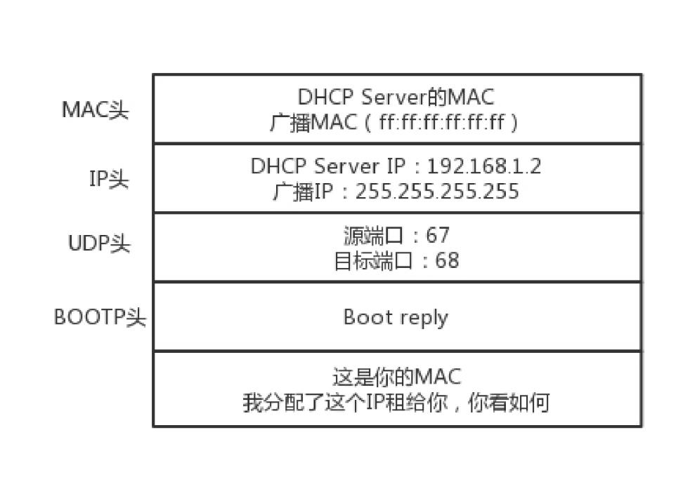

**IP 地址是一个网卡在网络世界的通讯地址，相当于现实世界的门牌号码**。

## 怎么查看 IP 地址

Windows 上是 `ipconfig`， 在Linux 上是 `ifconfig`，`ip addr`。

一台机器包含一个或多个网卡，大部分的网卡都会有一个 IP 地址（不是必须的）。

```sh
[root@VM_0_17_centos ~]# ip addr
1: lo: <LOOPBACK,UP,LOWER_UP> mtu 65536 qdisc noqueue state UNKNOWN qlen 1
    link/loopback 00:00:00:00:00:00 brd 00:00:00:00:00:00
    inet 127.0.0.1/8 scope host lo
       valid_lft forever preferred_lft forever
2: eth0: <BROADCAST,MULTICAST,UP,LOWER_UP> mtu 1500 qdisc mq state UP qlen 1000
    link/ether 52:54:00:7d:a2:a5 brd ff:ff:ff:ff:ff:ff
    inet 172.16.0.17/20 brd 172.16.15.255 scope global eth0
       valid_lft forever preferred_lft forever
```

运行 `ip addr` 显示了机器的所有网卡。上面的输出，IP 地址的后面有个 `scope`，对于 `eth0` 这张网卡来讲，是 `global`，说明这张网卡是
可以对外的，可以接收来自各个地方的包。

对于 `lo` 来讲，是 `host`，说明这张网卡仅仅可以供本机相互通信。`lo` 全称是 `loopback`，又称环回接口，往往会被分配到 `127.0.0.1` 这
个地址。这个地址用于本机通信，经过内核处理后直接返回，不会在任何网络中出现。这就是为什么你可以在浏览器通过访问 `127.0.0.1` 这个地址来
访问本地服务，而且一般在你本机的 `host` 文件，会有 `127.0.0.1 localhost`，这是个映射关系，访问 `localhost` 相当于 `127.0.0.1`。

### MAC 地址

`link/ether 52:54:00:7d:a2:a5 brd ff:ff:ff:ff:ff:ff`，这个是 **MAC 地址**，网卡的物理地址，十六进制，6 个 byte 表示。

MAC 地址是唯一的，不会有两个网卡有相同的 MAC 地址，那么为什么不直接用 MAC 地址来进行通信？

**一个网络包要从一个地方传到另一个地方，除了要有确定的地址，还需要有定位功能**。IP 地址，就是用来定位的。

**MAC 地址更像是身份证，是一个唯一的标识。它的唯一性设计是为了组网的时候，不同的网卡放在一个网络里面的时候，可以不用担心冲突**。
从硬件角度，保证不同的网卡有不同的标识。

例如，你去杭州市网商路 599 号B 楼6 层找刘超，你在路上问路，可能被问的人不知道 B 楼是哪个，但是可以给你指网商路怎么去。但是如果你问一
个人，你知道这个身份证号的人在哪里吗？可想而知，没有人知道。

MAC 地址是有一定定位功能的，只不过范围非常有限。你可以根据 IP 地址，找到杭州市网商路 599 号 B 楼6 层，但是依然找不到我，你就可以靠吼了，
大声喊身份证 XXXX 的是哪位？我听到了，我就会站起来说，是我啊。

MAC 地址的通信范围比较小，局限在一个子网里面。例如，例如，从 `192.168.0.2/24` 访问 `192.168.0.3/24` 是可以用 MAC 地址的。一旦跨
子网，即从 `192.168.0.2/24` 到 `192.168.1.2/24`，MAC 地址就不行了，需要 IP 地址起作用了。

### 网络设备的状态标识

`<BROADCAST,MULTICAST,UP,LOWER_UP>` 是干什么的？这个叫作 `net_device flags`，**网络设备的状态标识**。

- `UP` 表示网卡处于启动的状态
- `BROADCAST` 表示这个网卡有广播地址，可以发送广播包
- `MULTICAST` 表示网卡可以发送多播包
- `LOWER_UP` 表示`L1`是启动的，也即网线插着呢。
- `MTU1500` 是指最大传输单元 MTU 为 1500，这是以太网的默认值。MTU 是二层MAC 层的概念。MAC 层有 MAC 的头，以太网规定连 MAC 头带
正文合起来，不允许超过 1500 个字节。正文里面有 IP 的头、TCP 的头、HTTP 的头。如果放不下，就需要分片来传输。

## CIDR

32 位的 IP 地址就被分成了 5 类：


C 类地址能包含的最大主机数量只有 254 个（C 类地址只有后面 8 位表示主机号，最大数字为 255，`x.x.x.255` 是广播地址），现在估计一个网吧
都不够用。
B 类地址能包含的最大主机数量（65534 个）又太多了。6 万多台机器放在一个网络下面，一般的企业基本达不到这个规模，闲着的地址就是浪费。

CIDR 就是为了解决上面的问题。

五类地址中，D 类是**组播地址**。使用这一类地址，属于某个组的机器都能收到。这有点类似在公司里面大家都加入了一个邮件组。发送邮件，
加入这个组的都能收到。

### 无类型域间选路（CIDR）

CIDR，打破了原来设计的几类地址的做法，将 32 位的 IP 地址一分为二，前面是网络号，后面是主机号。上面例子中的 IP 地址：`172.16.0.17/20`，
这个 IP 地址中有一个斜杠，斜杠后面有个数字 20。这种地址表示形式，就是 CIDR。后面 20 的意思是，32 位中，前 20 位是网络号，后 12 位
是主机号。

伴随着 CIDR 存在的，一个是**广播地址**，`172.16.0.255`。如果发送这个地址，所有 `172.16.0` 网络里面的机器都可以收到。另一个
是**子网掩码**，`255.255.255.0`。将子网掩码和IP 地址进行 `AND` 计算，就可得到**网络号**。

### 公有 IP 地址和私有 IP 地址

在日常的工作中，几乎不用划分 A 类、B 类或者 C 类，所以时间长了，很多人就忘记了这个分类，而只记得 CIDR。但是有一点还是要注意的，
就是**公有 IP 地址**和**私有 IP 地址**。


表格最右列是私有 IP 地址段。平时我们看到的数据中心里，办公室、家里或学校的 IP 地址，一般都是私有 IP 地址段。因为这些地址允许组织内
部的 IT 人员自己管理、自己分配，而且可以重复。

这就像每个小区有自己的楼编号和门牌号，你们小区可以叫 6 栋，我们小区也叫 6 栋，没有任何问题。但是一旦出了小区，就需要使用公有 IP 地址。

`192.168.0.x` 是最常用的私有 IP 地址。一般你家里地上网设备不会超过 254 个，所以 `/24` 基本就够了。那么 `192.168.0` 就是网络号，
整个网络里面的第一个地址 `192.168.0.1`，一般都是**网关地址**，比如你家的路由器。`192.168.0.255` 就是**广播地址**。一旦发送这个
地址，整个 `192.168.0` 网络里面的所有机器都能收到。

### 一个容易“犯错”的 CIDR

`16.158.165.91/22` 这个 CIDR。求一下这个网络的第一个地址、子网掩码和广播地址。

要是上来就写 `16.158.165.1`，那就大错特错了。

`/22` 不是 8 的整数倍，不好办，只能先变成二进制来看。`16.158` 的部分不会动，它占了前 16 位。中间的 165，变为二进制为 `10100101`。
除了前面的 16 位，还剩 6 位。所以，这 8 位中前 6 位是网络号，`16.158.<101001>`，而 `<01>.91` 是机器号。第一个地址
是 `16.158.<101001><00>.1`，即 `16.158.164.1`。
子网掩码是 `255.255.<111111><00>.0`，即 `255.255.252.0`。广播地址为 `16.158.<101001><11>.255`，即 `16.158.167.255`。

## DHCP：IP 是怎么来的，又是怎么没的

### 如何配置 IP 地址

命令行自己配置一个地址。可以使用 `ifconfig`，也可以使用 `ip addr`。设置好了以后，用这两个命令，将网卡 up 一下，就可以开始工作了。

但是不能随便配置，例如 `192.168.1.6` 就在你这台机器的旁边，甚至是在同一个交换机上，而你把机器的地址设为了 `16.158.23.6`。在这台
机器上，你企图去 `ping 192.168.1.6`，你看着它有自己的源 IP 地址 `16.158.23.6`，也有目标 IP 地址 `192.168.1.6`，但是包发不出去，
这是因为 MAC 层还没填。**IP 只有是一个网段的，它才会发送 ARP 请求，获取 MAC 地址**。如果不是，**它便不会直接将包发送到网络上，而是
企图将包发送到网关**。

如果你配置了网关的话，Linux 会获取网关的 MAC 地址，然后将包发出去。对于 `192.168.1.6` 这台机器来讲，虽然路过它家门的这个包，
目标 IP 是它，但是无奈 MAC 地址不是它的，所以它的网卡是不会把包收进去的。如果没有配置网关，那包压根就发不出去。

**网关要和当前的网络至少一个网卡是同一个网段的**，否则不会配置成功。

### 动态主机配置协议（DHCP）

有了 DHCP 协议，网络管理员只需要配置一段共享的 IP 地址。每一台新接入的机器都通过 DHCP 协议，来这个共享的 IP 地址里申请，然后自动配
置好就可以了。等人走了，或者用完了，还回去，这样其他的机器也能用。

**如果是数据中心里面的服务器，IP 一旦配置好，基本不会变，这就相当于买房自己装修。 DHCP 的方式就相当于租房。你不用装修，都是帮你配
置好的。你暂时用一下，用完退租就可以了。**

### DHCP 的工作方式

一台机器新加入一个网络的时候，只知道自己的 MAC 地址。怎么办？先吼一句，我来啦，有人吗？这时候的沟通基本靠“吼”。这一步，
称为**DHCP Discover**。

第一步：
新来的机器使用 IP 地址 `0.0.0.0` 发送了一个广播包，目的 IP 地址为 `255.255.255.255`。


第二步：
**DHCP Server** 立刻能知道来了一个“新人”，这个时候，我们可以体会 MAC 地址唯一的重要性了。当一台机器带着自己的 MAC 地址加入一个网络
的时候，MAC 是它唯一的身份，如果连这个都重复了，就没办法配置了。**只有 MAC 唯一，IP 管理员才能知道这是一个新人**。租给它一个 IP 地址，
这个过程我们称为 **DHCP Offer**。同时，DHCP Server 为此客户**保留为它提供的 IP 地址**，从而不会为其他 DHCP 客户分配此 IP 地址。
**DHCP Offer 里面有新的分配的地址**：


DHCP Server 仍然使用广播地址作为目的地址，因为，此时请求分配 IP 的新人还没有自己的 IP。

第三步：
如果有多个 DHCP Server，这台新机器会收到多个 IP 地址，选择其中一个 DHCP Offer，**一般是最先到达的那个**。并且会向网络发送一
个 DHCP Request 广播数据包，包中包含客户端的 MAC 地址、接受的租约中的 IP 地址、提供此租约的 DHCP 服务器地址等，并告诉所
有 DHCP Server 它将接受哪一台服务器提供的 IP 地址，告诉其他 DHCP 服务器请求撤销它们提供的 IP 地址，以便提供给下一个 IP 租用请求者。


由于还没有得到 DHCP Server 的最后确认，客户端仍然使用 `0.0.0.0` 为源 IP 地址、`255.255.255.255` 为目标地址进行广播。

第四步：
DHCP Server 接收到客户机的 DHCP request 之后，会广播返回给客户机一个 DHCP ACK 消息包，表明已经接受客户机的选择，并将这一 IP 地址
的合法租用信息和其他的配置信息都放入该广播包，发给客户机，欢迎它加入网络大家庭。


### IP 地址的收回和续租

客户机会在租期过去 50% 的时候，直接向为其提供 IP 地址的 DHCP Server 发送 DHCP request 消息包。客户机接收到该服务器回应
的 DHCP ACK 消息包，会根据包中所提供的新的租期以及其他已经更新的 TCP/IP 参数，更新自己的配置。这样，IP 租用更新就完成了。
