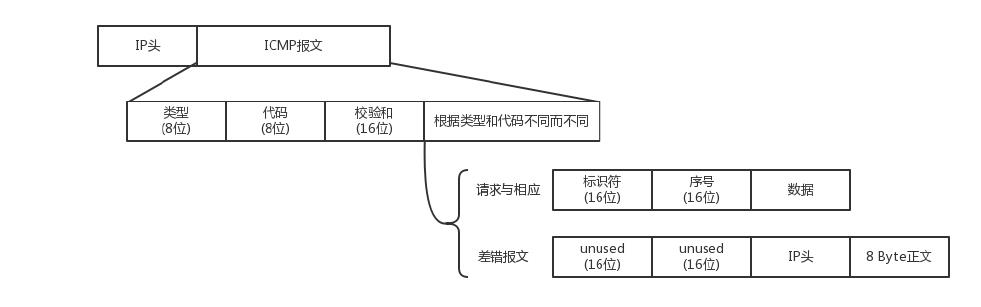

ICMP 全称 Internet Control Message Protocol，就是**互联网控制报文协议**。

ICMP 报文是封装在IP 包里面的：

ICMP 报文有很多的类型，不同的类型有不同的代码。最常用的类型是主动请求为 8，主动请求的应答为 0。

- 查询报文类型，如常用的 ping 就是查询报文，是一种主动请求，并且获得主动应答的 ICMP 协议。
- 差错报文类型，异常情况发起的，对应 ICMP 的差错报文类型。例如，终点不可达为 3，源抑制为 4，超时为 11，重定向为 5。

## ping

`ping` 是基于 ICMP 协议工作的。ping 的发送和接收过程：

1. 源主机首先会构建一个 ICMP 请求数据包，ICMP 数据包内包含多个字段。最重要的是两个，第一个是**类型字段**，对于请求数据包而言该字段为 8；
另外一个是**顺序号**，主要用于区分连续 ping 的时候发出的多个数据包。每发出一个请求数据包，顺序号会自动加 1。为了能够计算往返时间 RTT，
它会在报文的数据部分插入发送时间。然后，由 ICMP 协议将这个数据包连同地址 `192.168.1.2` 一起交给 IP 层。
2. IP 层将以 `192.168.1.2` 作为目的地址，本机IP 地址作为源地址，加上一些其他控制信息，构建一个IP 数据包。
3. 需要加入 MAC 头。如果在本地 ARP 映射表中查找出 IP 地址 `192.168.1.2` 所对应的 MAC 地址，则可以直接使用；如果没有，则需要
发送 ARP 请求查询MAC 地址，获得 MAC 地址后，由数据链路层构建一个数据帧。依据以太网的介质访问规则，将它们传送出去。
4. 主机 B 收到这个数据帧后，先检查它的目的 MAC 地址，并和本机的 MAC 地址对比，如符合，则接收，否则就丢弃。
5. 接收后检查该数据帧，将 IP 数据包从帧中提取出来，交给本机的 IP 层。同样，IP 层检查后，将有用的信息提取后交给 ICMP 协议。
6. 主机 B 会构建一个ICMP 应答包，应答数据包的类型字段为 0，顺序号为接收到的请求数据包中的顺序号，然后再发送出去给主机 A。
7. 在规定的时候间内，源主机如果没有接到 ICMP 的应答包，则说明目标主机不可达；如果接收到了 ICMP 应答包，则说明目标主机可达。

上面的过程是最简单的情况，在局域网中。
