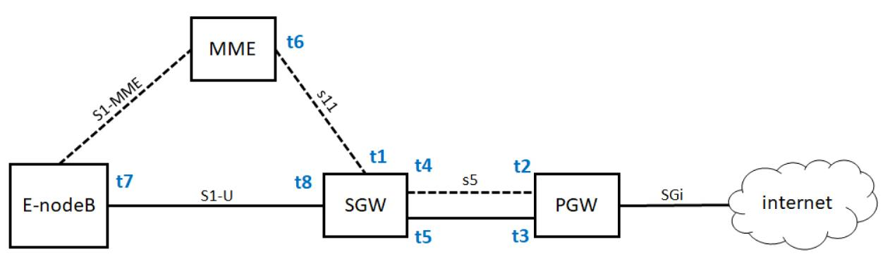

手机上网有 2G、3G、4G 的说法，究竟这都是什么意思呢？有一个通俗的说法就是：用 2G 看文字，用 3G 看图片，用 4G 看视频。

## 2G网络

在 2G 时代，上网使用的不是 IP 网络，而是电话网络，走模拟信号，专业名称为**公共交换电话网**（PSTN，Public Switched TelephoneNetwork）。

那手机不连网线，也不连电话线，它是怎么上网？

手机是通过收发无线信号来通信的，专业名称是 Mobile Station，简称 MS，需要嵌入 SIM。手机是客户端，而无线信号的服务端，就是基站子
系统（BSS，Base Station Subsystem）。

**无论无线通信如何无线，最终还是要连接到有线的网络里**。

基站子系统分两部分，一部分对外提供无线通信，叫作**基站收发信台**（BTS，Base Transceiver Station），另一部分对内连接有线网络，叫
作**基站控制器**（BSC，Base StationController）。基站收发信台通过无线收到数据后，转发给基站控制器。

属于无线的部分，统称为**无线接入网**（RAN，Radio Access Network）。

基站控制器通过有线网络，连接到提供手机业务的运营商的数据中心，这部分称为**核心网**（CN，Core Network）。**核心网还没有真的进入互联网，
这部分还是主要提供手机业务，是手机业务的有线部分**。

首先接待基站来的数据的是**移动业务交换中心**（MSC，Mobile Service Switching Center），它是进入核心网的入口，但是它不会让你直接连
接到互联网上。

因为在让你的手机真正进入互联网之前，提供手机业务的运营商，需要认证是不是合法的手机接入。别你自己造了一张手机卡，就连接上来。
**鉴权中心**（AUC，Authentication Center）和**设备识别寄存器**（EIR，Equipment Identity Register）主要是负责安全性的。

另外，需要看你是本地的号，还是外地的号，这个牵扯到计费的问题，异地收费还是很贵的。**访问位置寄存器**（VLR，Visit Location Register）
是看你目前在的地方，**归属位置寄存器**（HLR，Home Location Register）是看你的号码归属地。

当你的手机卡既合法又有钱的时候，才允许你上网，这个时候需要一个网关，连接核心网和真正的互联网。
**网关移动交换中心**（GMSC ，Gateway Mobile Switching Center）就是干这个的，然后是真正的互连网。在 2G 时代，还是电话网络 PSTN。

数据中心里面的这些模块统称为**网络子系统**（NSS，Network and Switching Subsystem）。

- **手机通过无线信号连接基站**；
- **基站一面朝前接无线，一面朝后接核心网**；
- **核心网一面朝前接到基站请求，一是判断你是否合法，二是判断你是不是本地号，还有没有钱，一面通过网关连接电话网络**。

## 2.5G网络

在原来电路交换的基础上，加入了分组交换业务，支持 Packet 的转发，从而支持 IP 网络。多了一个**分组控制单元**（PCU，Packet Control Unit），
用以提供分组交换通道。

在核心网里面，有个朝前的接待员（SGSN，Service GPRS Supported Node）和朝后连接 IP 网络的网关型 GPRS 支持节
点（GGSN，Gateway GPRS Supported Node）。

## 3G网络

线通信技术有了改进，大大增加了无线的带宽。

以 W-CDMA 为例，理论最高 2M 的下行速度，因而基站改变了，一面朝外的是 Node B，一面朝内连接核心网的是**无线网络控制器**
（RNC，Radio Network Controller）。核心网以及连接的 IP 网络没有什么变化。

## 4G网络

基站为 eNodeB，包含了原来 Node B 和 RNC 的功能，下行速度向百兆级别迈进。另外，核心网实现了控制面和数据面的分离：

在前面的核心网里面，有接待员 MSC 或者 SGSN，你会发现检查是否合法是它负责，转发数据也是它负责，也即控制面和数据面是合二为一的，这样
灵活性比较差，因为控制面主要是指令，多是小包，往往需要高的及时性；数据面主要是流量，多是大包，往往需要吞吐量。

HSS 用于存储用户签约信息的数据库，其实就是你这个号码归属地是哪里的，以及一些认证信息。

MME 是核心控制网元，是控制面的核心，当手机通过 eNodeB 连上的时候，MME 会根据 HSS 的信息，判断你是否合法。如果允许连上来，MME 不
负责具体的数据的流量，而是 MME 会选择数据面的 SGW 和 PGW，然后告诉 eNodeB，我允许你连上来了，你连接它们吧。

于是手机直接通过 eNodeB 连接 SGW，连上核心网，SGW 相当于数据面的接待员，并通过 PGW 连到 IP 网络。PGW 就是出口网关。在出口网关，有
一个组件 PCRF，称为**策略和计费控制单元**，用来控制上网策略和流量的计费。

## 手机上网流程

手机开机之后上网的流程，这个过程称为**Attach**。可以看出来，移动网络还是很复杂的。因为这个过程要建立很多的隧道，分配很多的隧道 ID:

1. 手机开机以后，在附近寻找基站 eNodeB，找到后给 eNodeB 发送 Attach Request，说“我来啦，我要上网”。
2. eNodeB 将请求发给 MME，说“有个手机要上网”。
3. MME 去请求手机，一是认证，二是鉴权，还会请求 HSS 看看有没有钱，看看是在哪里上网。
4. 当 MME 通过了手机的认证之后，开始分配隧道，先告诉 SGW，说要创建一个会话（Create Session）。在这里面，会给 SGW 分配一个隧
道 ID t1，并且请求 SGW 给自己也分配一个隧道 ID。
5. SGW 转头向 PGW 请求建立一个会话，为 PGW 的控制面分配一个隧道 ID t2，也给 PGW 的数据面分配一个隧道 ID t3，并且请求 PGW 给自己
的控制面和数据面分配隧道 ID。
6. PGW 回复 SGW 说“创建会话成功”，使用自己的控制面隧道 ID t2，回复里面携带着给 SGW 控制面分配的隧道 ID t4和控制面的隧道 ID t5，
至此 SGW 和 PGW 直接的隧道建设完成。双方请求对方，都要带着对方给自己分配的隧道 ID，从而标志是这个手机的请求。
7. 接下来 SGW 回复 MME 说“创建会话成功”，使用自己的隧道 ID t1 访问 MME，回复里面有给 MME 分配隧道 ID t6，也有 SGW 给 eNodeB 分配
的隧道 ID t7。
8. 当 MME 发现后面的隧道都建设成功之后，就告诉 eNodeB，“后面的隧道已经建设完毕，SGW给你分配的隧道 ID 是 t7，你可以开始连上来了，但
是你也要给 SGW 分配一个隧道 ID”。
9. eNodeB 告诉 MME 自己给 SGW 分配一个隧道，ID 为 t8。
10. MME 将 eNodeB 给 SGW 分配的隧道 ID t8 告知 SGW，从而前面的隧道也建设完毕。

### 异地上网问题

为什么要分 SGW 和 PGW，一个 GW 不可以吗？SGW 是你本地的运营商的设备，而 PGW 是你所属的运营商的设备。

如果你在巴塞罗那，一下飞机，手机开机，周围搜寻到的肯定是巴塞罗那的 eNodeB。通过 MME 去查寻国内运营商的 HSS，看你是否合法，是否还
有钱。如果允许上网，你的手机和巴塞罗那的 SGW 会建立一个隧道，然后巴塞罗那的 SGW 和国内运营商的 PGW 建立一个隧道，然后通过国内
运营商的 PGW 上网。

这样判断你是否能上网的在国内运营商的 HSS，控制你上网策略的是国内运营商的 PCRF，给手机分配的 IP 地址也是国内运营商的 PGW 负责的，给
手机分配的 IP 地址也是国内运营商里统计的。运营商由于是在 PGW 里面统计的，这样你的上网流量全部通过国内运营商即可，只不过巴塞罗那运营商
也要和国内运营商进行流量结算。由于你的上网策略是由国内运营商在 PCRF 中控制的，因而你还是上不了脸书。
