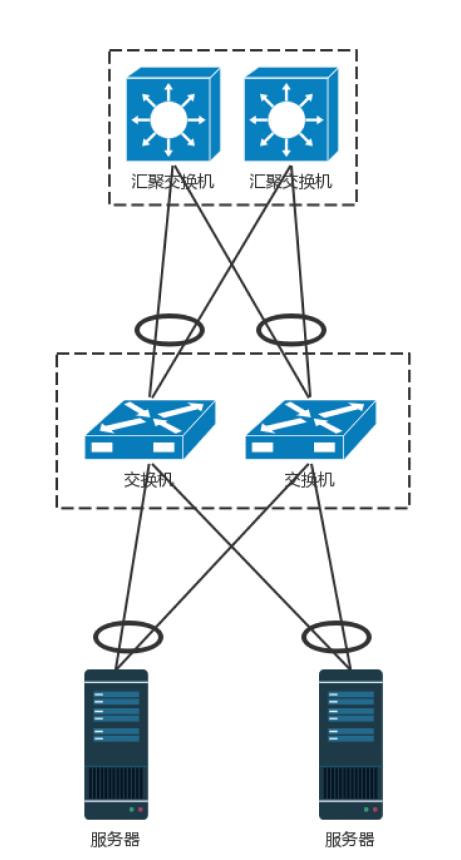

# 数据中心

## 数据中心：我是开发商，自己拿地盖别墅
数据中心用到了前面学过的所有知识，数据中心里面是一堆服务器。服务器被放在一个个叫作**机架（Rack）**的架子上面，出入口也是漏油器，在数
据中心的边界，所以叫做**边界路由器**，为了高可用，边界路由器有多个，而且会连接多个运营商网络，防止一个运营商网络出问题。

交换机往往是放在机架顶端的，所以经常称为 **TOR（Top Of Rack）交换机**。这一层的交换机常常称为**接入层（Access Layer）**。

当一个机架放不下的时候，就需要多个机架，还需要有交换机将多个机架连接在一起。这些交换机对性能的要求更高，带宽也更大。这些交
换机称为**汇聚层交换机（AggregationLayer）**。

**数据中心里面的每一个连接都是需要考虑高可用的**。这里首先要考虑的是，如果一台机器只有一个网卡，上面连着一个网线，接入到 TOR 交换机上。
如果网卡坏了，或者不小心网线掉了，机器就上不去了。所以，需要至少两个网卡、两个网线插到 TOR 交换机上，但是两个网卡要工作得像一张网卡一样，
这就是常说的**网卡绑定（bond）**。

这就需要服务器和交换机都支持一种协议 **LACP（Link Aggregation Control Protocol）**。它们互相通信，将多个网卡聚合称为一个网卡，多个
网线聚合成一个网线，在网线之间可以进行负载均衡，也可以为了高可用作准备。

TOR 交换机也需要高可用，同理接入层和汇聚层的连接也需要高可用性，也不能单线连着。

最传统的方法是，部署两个接入交换机、两个汇聚交换机。服务器和两个接入交换机都连接，接入交换机和两个汇聚都连接，当然这样会形成环，所
以需要启用 STP 协议，去除环，但是这样两个汇聚就只能一主一备了。

交换机有一种技术叫作堆叠，所以另一种方法是，将多个交换机形成一个逻辑的交换机，服务器通过多根线分配连到多个接入层交换机上，而接入层交
换机多根线分别连接到多个交换机上，并且通过堆叠的私有协议，形成双活的连接方式。

汇聚层将大量的计算节点相互连接在一起，形成一个集群。在这个集群里面，服务器之间通过二层互通，这个区域常称为
一个 **POD（Point Of Delivery）**，有时候也称为一个**可用区（Available Zone）**。

当节点数目再多的时候，一个可用区放不下，需要将多个可用区连在一起，连接多个可用区的交换机称为**核心交换机**。

核心交换机吞吐量更大，高可用要求更高，肯定需要堆叠，但是往往仅仅堆叠，不足以满足吞吐量，因而还是需要部署多组核心交换机。核心和汇聚
交换机之间为了高可用，也是全互连模式的。