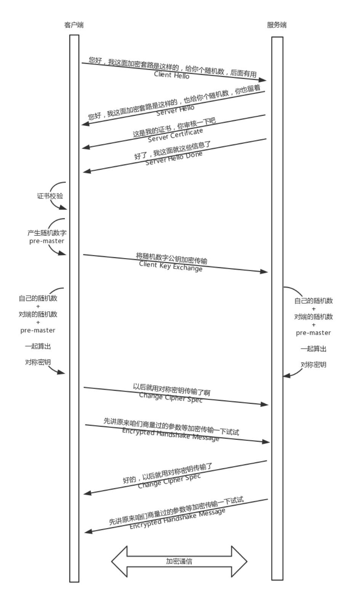

# HTTPS

不使用 SSL/TLS 的 HTTP 通信，就是不加密的通信。所有信息明文传播，带来了三大风险。
1. 窃听风险（eavesdropping）：第三方可以获知通信内容。
2. 篡改风险（tampering）：第三方可以修改通信内容。
3. 冒充风险（pretending）：第三方可以冒充他人身份参与通信。

SSL/TLS 协议是为了解决这三大风险而设计的，希望达到：
1. 所有信息都是加密传播，第三方无法窃听。
2. 具有校验机制，一旦被篡改，通信双方会立刻发现。
3. 配备身份证书，防止身份被冒充。

加密分为两种方式一种是**对称加密**（加密和解密使用的是同一个密钥），一种是**非对称加密**（加密使用的密钥和解密使用的密钥是不相同的。
一把是作为公开的公钥，另一把是作为谁都不能给的私钥。公钥加密的信息，只有私钥才能解密。私钥加密的信息，只有公钥才能解密）。

关于数字证书可以看 [数字签名是什么？](http://www.ruanyifeng.com/blog/2011/08/what_is_a_digital_signature.html) 这篇文
章，生动形象。

### HTTPS 的工作模式
非对称加密在性能上不如对称加密，那是否能将两者结合起来呢？例如，公钥私钥主要用于传输对称加密的秘钥，而真正的双方大数据量的通信都是通
过对称加密进行的。

证书校验这一步，一般浏览器的"证书管理器"会有"受信任的根证书颁发机构"列表。如果数字证书记载的网址，与你正在浏览的网址不一致，就
说明这张证书可能被冒用，浏览器会发出警告。如果这张数字证书不是由受信任的机构颁发的，浏览器会发出另一种警告。

客户端拿到服务端证书之后，从自己信任的 CA 仓库中，拿 CA 的证书里面的公钥去解密外卖网站的证书。如果能够成功，则说明外卖网站是可信的。
这个过程中，你可能会不断往上追溯 CA、CA 的 CA、CA 的 CA 的 CA，反正直到一个授信的 CA，就可以了。
