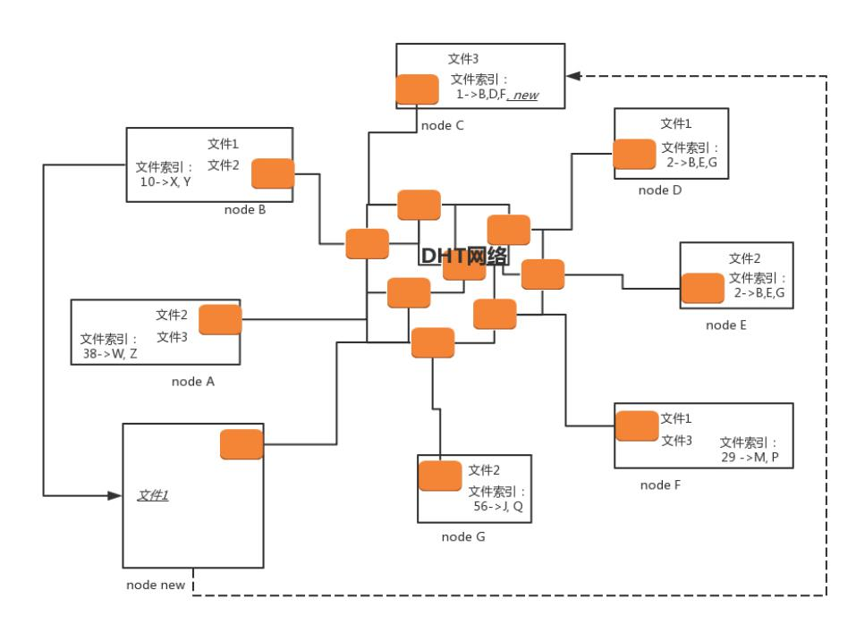

# P2P 协议

下载文件最简单的方式 HTTP，但是下载很慢，可以使用 FTP（文件传输协议）。

## FTP
FTP 采用两个TCP 连接来传输一个文件：
- **控制连接**：服务器以被动的方式，打开众所周知用于 FTP 的端口 21，客户端则主动发起连接。该连接将命令从客户端传给服务器，并传回服
务器的应答。常用的命令有：`list` —— 获取文件目录；`reter` —— 取一个文件；`store` —— 存一个文件。
- **数据连接**：每当一个文件在客户端与服务器之间传输时，就创建一个数据连接。

### FTP 的两种模式
两种模式都是站在 FTP 服务器的角度来说的。
### 主动模式（PORT）
客户端随机打开一个大于 1024 的端口 N，向服务器的命令端口 21 发起连接，同时开放 N+1 端口监听，并向服务器发出 `port N+1` 命令，由服务
器从自己的数据端口 20，主动连接到客户端指定的数据端口 N+1。
### 被动模式（PASV）
当开启一个 FTP 连接时，客户端打开两个任意的本地端口 N（大于 1024）和 N+1。第一个端口连接服务器的 21 端口，提交 PASV 命令。然后，服
务器会开启一个任意的端口 P（大于 1024），返回 `227 entering passive mode` 消息，里面有 FTP 服务器开放的用来进行数据传输的端口。客
户端收到消息取得端口号之后，会通过 N+1 号端口连接服务器的端口 P，然后在两个端口之间进行数据传输。

## P2P 是什么
无论是 HTTP 的方式，还是 FTP 的方式，都有一个比较大的缺点，就是难以解决单一服务器的带宽压力，因为它们使用的都是传统的客户端服务器的方式。

**P2P 就是 peer-to-peer**。资源开始并不集中地存储在某些设备上，而是分散地存储在多台设备上。这些设备我们称为 peer。

想要下载一个文件的时候，你只要得到那些已经存在了文件的 peer，并和这些 peer 之间，建立点对点的连接，而不需要到中心服务器上，就可以
就近下载文件。一旦下载了文件，你也就成为 peer 中的一员，你旁边的那些机器，也可能会选择从你这里下载文件，所以当你使用 P2P 软件的时候，
例如 BitTorrent，往往能够看到，既有下载流量，也有上传的流量，也即你自己也加入了这个P2P 的网络，自己从别人那里下载，同时也提供给其他人
下载。可以想象，这种方式，参与的人越多，下载速度越快，一切完美。

### 种子（.torrent）文件
怎么知道哪些 peer 有你要下载的文件？

这就用到种子啦，也即咱们比较熟悉的 `.torrent` 文件。`.torrent` 文件由两部分组成，分别是：**announce（tracker URL）和 文件信息**。

文件信息里面有这些内容:
- **info 区**：这里指定的是该种子有几个文件、文件有多长、目录结构，以及目录和文件的名字。
- **Name 字段**：指定顶层目录名字。
- **每个段的大小**：BitTorrent（简称 BT）协议把一个文件分成很多个小段，然后分段下载。
- **段哈希值**：将整个种子中，每个段的 SHA-1 哈希值拼在一起。

下载时，BT 客户端首先解析 `.torrent` 文件，得到 tracker 地址，然后连接 tracker 服务器。tracker 服务器回应下载者的请求，将其他
下载者（包括发布者）的 IP 提供给下载者。下载者再连接其他下载者，根据 `.torrent` 文件，两者分别对方告知自己已经有的块，然后交换对方
没有的数据。此时不需要其他服务器参与，并分散了单个线路上的数据流量，因此减轻了服务器的负担。

下载者每得到一个块，需要算出下载块的 Hash 验证码，并与 `.torrent` 文件中的对比。如果一样，则说明块正确，不一样则需要重新下载这个块。
这种规定是为了解决下载内容的准确性问题。

这种方式特别依赖 tracker。tracker 需要收集下载者信息的服务器，并将此信息提供给其他下载者，使下载者们相互连接起来，传输数据。虽然
下载的过程是非中心化的，但是加入这个 P2P 网络的时候，都需要借助 tracker 中心服务器，这个服务器是用来登记有哪些用户在请求哪些资源。

一旦 tracker 服务器出现故障或者线路遭到屏蔽，BT 工具就无法正常工作了。

## 去中心化网络（DHT）
**DHT（Distributed Hash Table）去中心化网络，每个加入这个 DHT 网络的人，都要负责存储这个网络里的资源信息和其他成员的联系信息，相当
于所有人一起构成了一个庞大的分布式存储数据库**。

有一种著名的 DHT 协议，叫 Kademlia 协议。这个和区块链的概念一样。

任何一个 BitTorrent 启动之后，它都有两个角色。一个是 peer，监听一个 TCP 端口，用来上传和下载文件，这个角色表明，我这里有某个文件。
另一个角色 DHT node，监听一个 UDP 的端口，通过这个角色，这个节点加入了一个 DHT 的网络。

在 DHT 网络里面，每一个 DHT node 都有一个 ID。这个 ID 是一个很长的串。每个 DHT node 都有责任掌握一些知识，也就是文件索引，也即
它应该知道某些文件是保存在哪些节点上。它只需要有这些知识就可以了，而它自己本身不一定就是保存这个文件的节点。

### 哈希值
每个 DHT node 不会有全局的知识，也即不知道所有的文件保存在哪里，它只需要知道一部分。那应该知道哪一部分呢？这就需要用哈希
算法计算出来。

每个文件可以计算出一个哈希值，而 **DHT node 的 ID 是和哈希值相同长度的串**。

DHT 算法是这样规定的：**如果一个文件计算出一个哈希值，则和这个哈希值一样的那个 DHT node，就有责任知道从哪里下载这个文件，即便它自己
没保存这个文件**。

当然不一定这么巧，总能找到和哈希值一模一样的，有可能一模一样的 DHT node 也下线了，所以 DHT 算法还规定：**除了一模一样的
那个 DHT node 应该知道，ID 和这个哈希值非常接近的 N 个 DHT node 也应该知道**。

什么叫和哈希值接近呢？例如只修改了最后一位，就很接近；修改了倒数 2 位，也不远；修改了倒数 3 位，也可以接受。总之，凑齐了规定的 N 这个
数就行。

刚才那个图里，文件 1 通过哈希运算，得到匹配 ID 的 DHT node 为 node C，当然还会有其他的，我这里没有画出来。所以，node C 有责任知道
文件 1 的存放地址，虽然 node C 本身没有存放文件 1。

接下来一个新的节点 node new 上线了。如果想下载文件 1，它首先要加入 DHT 网络，如何加入呢？

在这种模式下，种子 `.torrent` 文件里面就不再是 tracker 的地址了，而是一个 list 的 node 的地址，而所有这些 node 都是已经在 DHT 网络
里面的。当然随着时间的推移，很可能有退出的，有下线的，但是我们假设，不会所有的都联系不上，总有一个能联系上。

node new 只要在种子里面找到一个 DHT node，就加入了网络。

node new 会计算文件 1 的哈希值，并根据这个哈希值了解到，和这个哈希值匹配，或者很接近的 node 上知道如何下载这个文件，例如计算出来的哈
希值就是 node C。

但是 node new 不知道怎么联系上 node C，因为种子里面的 node 列表里面很可能没有 node C，但是它可以问，DHT 网络特别像一个社交网
络，node new 只有去它能联系上的 node 问，你们知道不知道 node C 的联系方式呀？

在 DHT 网络中，每个 node 都保存了一定的联系方式，但是肯定没有 node 的所有联系方式。DHT 网络中，节点之间通过互相通信，也会交流联
系方式，也会删除联系方式。和人们的方式一样，你有你的朋友圈，你的朋友有它的朋友圈，你们互相加微信，就互相认识了，过一段时间不联系，就删
除朋友关系。

所以，node new 想联系 node C，就去万能的朋友圈去问，并且求转发，朋友再问朋友，很快就能找到。如果找不到 C，也能找到和 C 的 ID 很像的节
点，它们也知道如何下载文件 1。

在 node C 上，告诉 node new，下载文件 1，要去 B、D、F，于是 node new 选择和 node B 进行 peer 连接，开始下载，它一旦开始下载，自己
本地也有文件 1 了，于是 node new 告诉 node C 以及和 node C 的 ID 很像的那些节点，我也有文件 1 了，可以加入那个文件拥有者列表了。

但是你会发现 node new 上没有文件索引，但是根据哈希算法，一定会有某些文件的哈希值是和 node new 的 ID 匹配上的。在 DHT 网络中，会有
节点告诉它，你既然加入了咱们这个网络，你也有责任知道某些文件的下载地址。
