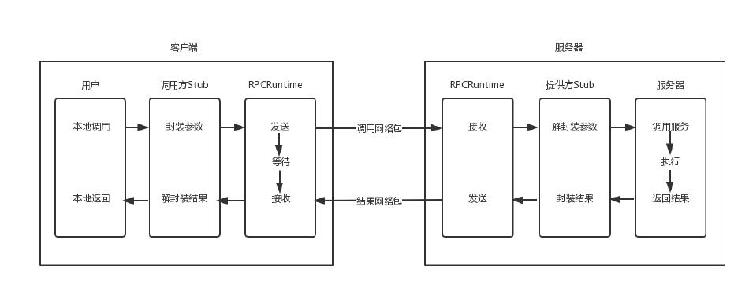
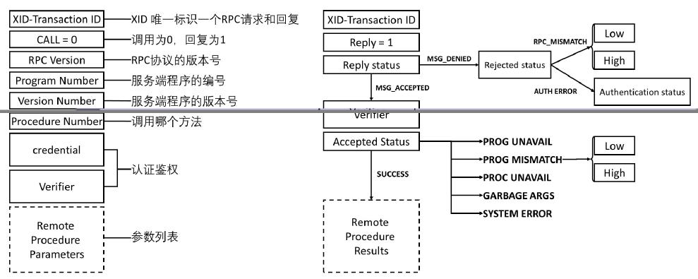
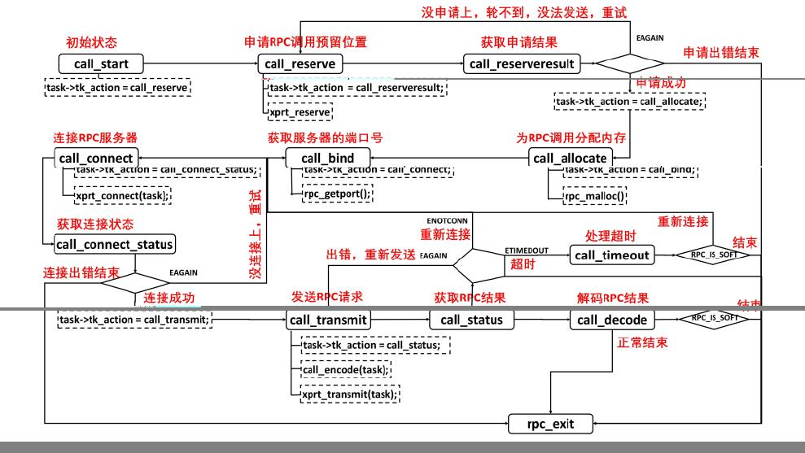
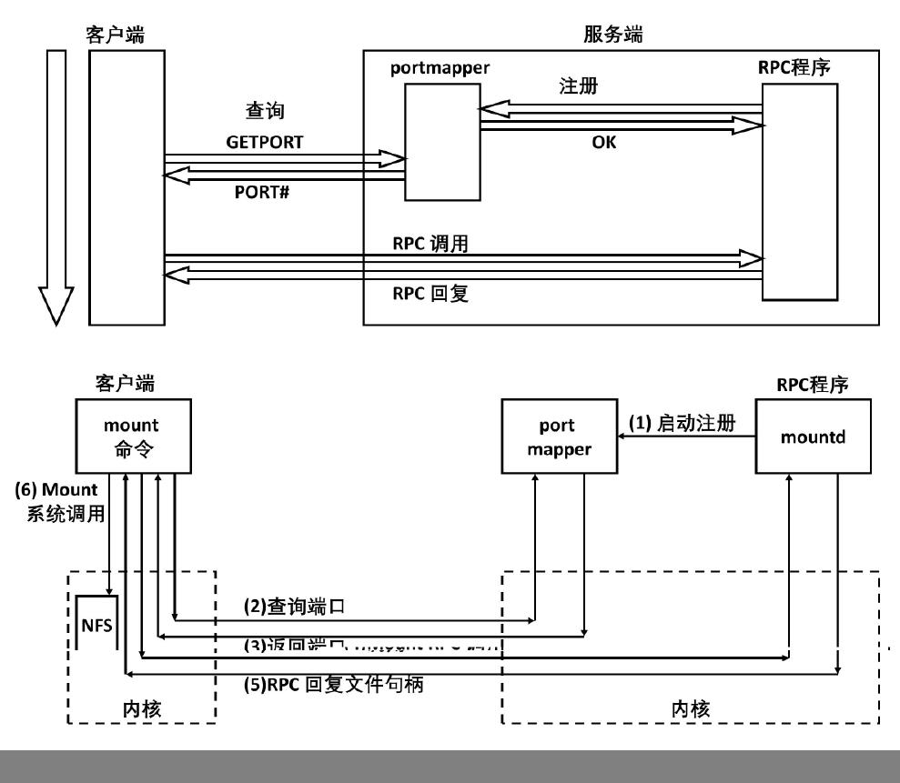

# RPC

RPC 框架的目标就是让远程服务调用更加简单、透明，RPC 框架负责屏蔽底层的传输方式（TCP 或者 UDP）、序列化方式（XML/Json/ 二进制）和通
信细节。服务调用者可以像调用本地接口一样调用远程的服务提供者，而不需要关心底层通信细节和调用过程。

## 实现 RPC 框架要解决的问题
实现一个 RPC 框架要解决五个问题。

### 如何规定远程调用的语法
客户端如何告诉服务端，我是一个加法，而另一个是乘法。我是用字符串 `add` 传给你，还是传给你一个整数，比如 1 表示加法，2 表示乘法？服
务端该如何告诉客户端，我的这个加法，目前只能加整数，不能加小数，不能加字符串；而另一个加法 `add1`，它能实现小数和整数的混合加法。
那返回值是什么？正确的时候返回什么，错误的时候又返回什么？

### 如何传递参数
我是先传两个整数，后传一个操作符 `add`，还是先传操作符，再传两个整数？是不是像咱们数据结构里一样，如果都是 UDP，想要实现一个逆波兰表
达式，放在一个报文里面还好，如果是 TCP，是一个流，在这个流里面，如何将两次调用进行分界？什么时候是头，什么时候是尾？别这次的参数和
上次的参数混了起来，TCP 一端发送出去的数据，另外一端不一定能一下子全部读取出来。所以，怎么才算读完呢？

### 如何表示数据
在这个简单的例子中，传递的就是一个固定长度的 int 值，这种情况还好，如果是变长的类型，是一个结构体，甚至是一个类，应该怎么办？
如果是 int，不同的平台上长度也不同，该怎么办？在网络上传输超过一个 Byte 的类型，还有大端 Big Endian 和小端 Little Endian 的问题。
假设我们要在 32 位四个 Byte 的一个空间存放整数 1，很显然只要一个 Byte 放 1，其他三个 Byte 放 0 就可以了。那问题是，最后一
个 Byte 放 1 呢，还是第一个 Byte 放 1 呢？或者说 1 作为最低位，应该是放在 32 位的最后一个位置呢，还是放在第一个位置？最低位放在
最后一个位置，叫作 Little Endian，最低位放在第一个位置，叫作 Big Endian。TCP/IP 协议栈是按照 Big Endian 来设计的，而 X86 机器多
按照 Little Endian 来设计的，因而发出去的时候需要做一个转换。

### 如何知道一个服务端都实现了哪些远程调用？从哪个端口可以访问这个远程调用？
假设服务端实现了多个远程调用，每个可能实现在不同的进程中，监听的端口也不一样，而且由于服务端都是自己实现的，不可能使用一个
大家都公认的端口，而且有可能多个进程部署在一台机器上，大家需要抢占端口，为了防止冲突，往往使用随机端口，那客户端如何找到这些监听的端口呢？

### 发生了错误、重传、丢包、性能等问题怎么办
本地调用没有这个问题，但是一旦到网络上，这些问题都需要处理，因为网络是不可靠的，虽然在同一个连接中，我们还可通过TCP协议保证丢包、重
传的问题，但是如果服务器崩溃了又重启，当前连接断开了，TCP就保证不了了，需要应用自己进行重新调用，重新传输会不会同样的操作做两遍，远程
调用性能会不会受影响？

## 协议约定问题

所有 RPC 框架，都是按照这个[标准](http://xueshu.baidu.com/usercenter/paper/show?paperid=c15b4493e13e55a140660d51e1b6b78d&site=xueshu_se)模式来实现的。

当客户端的应用想发起一个远程调用时，它实际是通过本地调用 Stub。它负责**将调用的接口、方法和参数，通过约定的协议规范进行编码**，
并通过本地的 RPCRuntime 进行传输，将调用网络包发送到服务器。

服务器端的 RPCRuntime 收到请求后，交给 Stub 进行解码，然后调用服务端的方法，服务端执行方法，返回结果， Stub 将返回结果编码后，发送
给客户端，客户端的 RPCRuntime 收到结果，发给调用方 Stub 解码得到结果，返回给客户端。

这里面分了三个层次，对于用户层和服务端，都像是本地调用一样，专注于业务逻辑的处理就可以了。对于 Stub 层，处理双方约定好的语法、语义、
封装、解封装。对于 RPCRuntime，主要处理高性能的传输，以及网络的错误和异常。

最早的 RPC 的一种实现方式称为 Sun RPC 或 ONC RPC。Sun 公司是第一个提供商业化 RPC 库和 RPC 编译器的公司。这个 RPC 框架是
在 NFS 协议中使用的。

NFS（Network File System）就是网络文件系统。要使 NFS 成功运行，要启动两个服务端，一个是 mountd，用来挂载文件路径；一个是 nfsd，用
来读写文件。NFS 可以在本地 mount 一个远程的目录到本地的一个目录，从而本地的用户在这个目录里面写入、读出任何文件的时候，其实操作
的是远程另一台机器上的文件。

操作远程和远程调用的思路是一样的，就像操作本地一样。所以 NFS 协议就是基于 RPC 实现的。无论是什么 RPC，底层都是 Socket 编程。

在 RPC 的调用过程中，所有的数据类型都要封装成下面类似的格式。而且 RPC 的调用和结果返回，也有严格的格式。
- XID 唯一标识一对请求和回复。请求为 0，回复为 1。
- RPC 有版本号，两端要匹配 RPC 协议的版本号。如果不匹配，就会返回 Deny，原因就是 RPC_MISMATCH。
- 程序有编号。如果服务端找不到这个程序，就会返回 PROG_UNAVAIL。
- 程序有版本号。如果程序的版本号不匹配，就会返回 PROG_MISMATCH。
- 一个程序可以有多个方法，方法也有编号，如果找不到方法，就会返回 PROC_UNAVAIL。
- 调用需要认证鉴权，如果不通过，则 Deny。
- 最后是参数列表，如果参数无法解析，则返回 GABAGE_ARGS。

为了可以成功调用 RPC，在客户端和服务端实现 RPC 的时候，首先要定义一个双方都认可的程序、版本、方法、参数等。

双方要约定为一个协议定义文件，同理如果是 NFS、mount 和读写，也会有类似的定义。有了协议定义文件，ONC RPC 会提供一个工具，根据这个文
件生成客户端和服务器端的 Stub 程序。

“如何规定远程调用的语法？” “如何传递参数？” 以及 “如何表示数据？” 这三个问题我们统称为**协议约定问题**。

## 传输问题
错误、重传、丢包、性能等问题称为传输问题。ONC RPC 的类库解决例如传输问题，这个类库中，对于每一个客户端，都会创建一个传输管理层，而
每一次 RPC 调用，都会是一个任务，在传输管理层，你可以看到熟悉的队列机制、拥塞窗口机制等。

由于在网络传输的时候，经常需要等待，因而同步的方式往往效率比较低，因而也就有 Socket 的异步模型。为了能够异步处理，对于远程调用
的处理，往往是通过状态机来实现的。只有当满足某个状态的时候，才进行下一步，如果不满足状态，不是在那里等，而是将资源留出来，用来处理
其他的 RPC 调用。

首先，进入起始状态，查看 RPC 的传输层队列中有没有空闲的位置，可以处理新的 RPC 任务。如果没有，说明太忙了，或直接结束或重试。如果
申请成功，就可以分配内存，获取服务的端口号，然后连接服务器。连接的过程要有一段时间，因而要等待连接的结果，会有连接失败，或直接结
束或重试。如果连接成功，则开始发送 RPC 请求，然后等待获取RPC结果，这个过程也需要一定的时间；如果发送出错，可以重新发送；如果连接
断了，可以重新连接；如果超时，可以重新传输；如果获取到结果，就可以解码，正常结束。

## 服务发现问题
如何找到 RPC 服务端的那个随机端口就是服务发现问题。在 ONC RPC 中，服务发现是通过 portmapper 实现的。

portmapper 会启动在一个众所周知的端口上，RPC 程序由于是用户自己写的，会监听在一个随机端口上，但是 RPC 程序启动的时候，
会向 portmapper 注册。客户端要访问 RPC 服务端这个程序的时候，首先查询 portmapper，获取 RPC 服务端程序的随机端口，然后向这
个随机端口建立连接，开始 RPC 调用。

## 二进制类 RPC
RPC 调用，应该用二进制还是文本类？

其实**文本的最大问题是，占用字节数目比较多**。比如数字 123，其实本来二进制 8 位就够了，但是如果变成文本，就成了字符串 123。如果
是 UTF-8 编码的话，就是三个字节；如果是 UTF-16，就是六个字节。**同样的信息，要多费好多的空间，传输起来也更加占带宽，时延也高**。

## gRPC

RPC 框架的要求：
- 首先，传输性能很重要。因为服务之间的调用如此频繁了，还是二进制的越快越好。
- 其次，跨语言很重要。因为服务多了，什么语言写成的都有，而且不同的场景适宜用不同的语言，不能一个语言走到底。
- 最好既严谨又灵活，添加个字段不用重新编译和发布程序。
- 最好既有服务发现，也有服务治理，就像 Dubbo 和 Spring Cloud 一样

业界主流的 RPC 框架整体上分为三类：

- 支持多语言的 RPC 框架，Google 的 gRPC、Apache（Facebook）的 Thrift；
- 只支持特定语言的 RPC 框架，例如新浪微博的 Motan；
- 支持服务治理等服务化特性的分布式服务框架，其底层内核仍然是 RPC 框架, 如阿里的 Dubbo。

随着微服务的发展，基于语言中立性原则构建微服务，逐渐成为一种主流模式，例如对于后端并发处理要求高的微服务，比较适合采用 Go 语言构建，
而对于前端的 Web 界面，则更适合 Java 和 JavaScript。

因此，基于多语言的 RPC 框架来构建微服务，是一种比较好的技术选择。例如 Netflix，API 服务编排层和后端的微服务之间就采用 gRPC 进行通信。

### gRPC 特点
- 语言中立，支持多种语言；
- 基于 IDL 文件定义服务，通过 proto3 工具生成指定语言的数据结构、服务端接口以及客户端 Stub；
- 通信协议基于标准的 HTTP/2 设计，支持双向流、消息头压缩、单 TCP 的多路复用、服务端推送等特性，这些特性使得 gRPC 在移动端设备上
更加省电和节省网络流量；
- 序列化支持 PB（Protocol Buffer）和 JSON，PB 是一种语言无关的高性能序列化框架，基于 HTTP/2 + PB, 保障了 RPC 调用的高性能。