# TCP
TCP 认为网络环境是恶劣的，丢包、乱序、重传，拥塞都是常有的事情，一言不合就可能送达不了，因而要从算法层面来保证可靠性。 主要有下
面几个方面：
- 对每个包提供校验和
- 包的序列号解决了接收数据的乱序、重复问题
- 超时重传
- 流量控制、拥塞控制

## 什么是流
TCP 面向字节流的协议。**流的含义是没有固定的报文边界**。

假设调用 2 次 write 函数往 socket 里依次写 500 字节、800 字节。write 函数只是把字节拷贝到内核缓冲区，最终会以多少条报文发送
出去是不确定的：
- 情况 1：分为两条报文依次发出去 500 字节 和 800 字节数据
- 情况 2：两部分数据合并为一个长度为 1300 字节的报文，一次发送
- 情况 3：第一部分的 500 字节与第二部分的 500 字节合并为一个长度为 1000 字节的报文，第二部分剩下的 300 字节单独作为一个报文发送
- 情况 4：第一部分的 400 字节单独发送，剩下100字节与第二部分的 800 字节合并为一个 900 字节的包一起发送。
- 情况 N：更多可能的拆分组合

上面出现的情况**取决于诸多因素：路径最大传输单元 MTU、发送窗口大小、拥塞窗口大小等**。

## TCP 包头
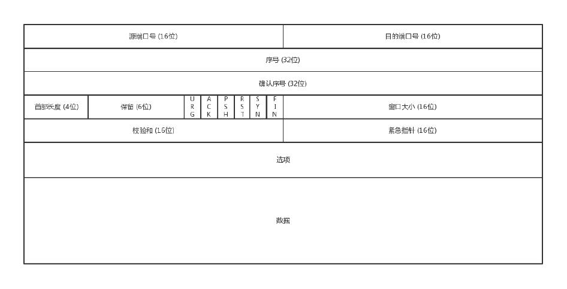

- 序号（序列号），为了解决乱序，重复的问题。
- 确认序号，发出去的包要确认，不然怎么知道有没有收到。没有收到就重发，直到送达。
- 状态位，SYN 是发起一个连接，ACK 是回复，RST 是重连，FIN 是结束连接。双方要维护连接的状态，这些带状态位的包的发送，会引起双方的状
态变更。
- 窗口大小，TCP 要做流量控制，双方各自声明一个窗口，表示自己当前能够的处理能力，避免发的太快或者太慢。TCP 还会做拥塞控制。

### 序号
通过 TCP 传输的字节流的每个字节都分配了序列号，序列号（Sequence number，SEQ）指的是本报文段第一个字节的序列号。

序列号加上报文的长度，就可以确定传输的是哪一段数据。

**在 SYN 报文中，序列号用于交换彼此的初始序列号，在其它报文中，序列号用于保证包的顺序**。

#### 初始序列号
在建立连接之初，通信双方都会各自选择一个序列号，称之为初始序列号（Initial Sequence Number, ISN）。在建立连接时，通信双方
通过 SYN 报文交换彼此的 ISN。

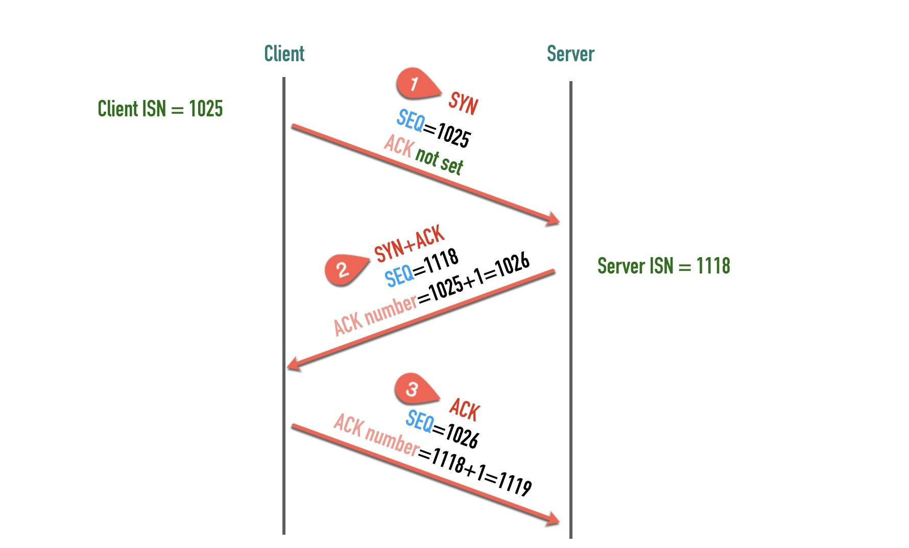
### 确认序号
TCP 使用确认号（Acknowledgment number, ACK）来告知对方下一个期望接收的序列号，小于此确认号的所有字节都已经收到。
- ACK 包本身不需要被确认，否则就会无穷无尽死循环了
- 确认号永远是表示小于此确认号的字节都已经收到

## 最大传输单元
数据链路层传输的帧大小是有限制的，不能把一个太大的包直接塞给链路层，这个限制被称为
**最大传输单元**（Maximum Transmission Unit, MTU）。

以太网的帧最小的帧是 64 字节，除去 14 字节头部和 4 字节 CRC 字段，有效荷载最小为 46 字节。最大的帧是 1518 字节，有效荷载最大
为 1500，这个值就是以太网的 MTU。计算一下传输 100KB 的数据，至少需要 （100 * 1024 / 1500) = 69 个以太网帧。


**不同的数据链路层的 MTU 是不同的**。通过 `netstat -i` 可以查看网卡的 mtu。

### 路径 MTU
一个包从发送端传输到接收端，中间要跨越很多个网络，每条链路的 MTU 都可能不一样，这个通信过程中最小的 MTU 称为**路径 MTU**（Path MTU）。
就好比开车有时候开的是双向 4 车道，有时候可能是乡间小路一样。

路径 MTU 就跟木桶效应是一个道理，木桶的盛水量由最短的那条短板决定，**路径 MTU 也是由通信链条中最小的 MTU 决定**。

## IP 分段
IPv4 数据报的最大大小为 65535 字节，这已经远远超过了以太网的 MTU，而且有些网络还会开启巨帧（Jumbo Frame）能达到 9000 字节。
当一个 IP 数据包大于 MTU 时，IP 会把数据报文进行切割为多个小的片段(小于 MTU），使得这些小的报文可以通过链路层进行传输。

IP 头部中有一个 13 位表示**分片偏移量**的字段，用来表示该分段在原始数据报文中的位置。

例如下面的包：
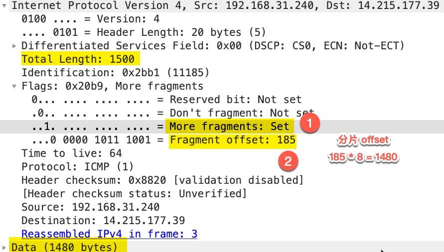

`More fragments` 处于 `set` 状态，表示后面还有其它分片，`Fragment offset: 185` 这里并不是表示分片偏移量为 185，wireshark 这
里显示的时候除以了 8，真实的分片偏移量为 `185 * 8 = 1480`。

如果 `More fragments` 处于 `Not set` 状态，表示这是最后一个分片了。

## TCP 最大段大小
TCP 为了避免被发送方分片，会主动把数据分割成小段再交给网络层，最大的分段大小称之为 MSS（Max Segment Size）。
```
MSS = MTU - IP header头大小 - TCP 头大小
```

这样一个 MSS 的数据恰好能装进一个 MTU 而不用分片。

在以太网中 TCP 的 `MSS = 1500（MTU） - 20（IP 头大小） - 20（TCP 头大小）= 1460`。

## 端口号
端口号可以分为 3 类：

- 熟知端口号（well-known port），熟知端口号由专门的机构
由 [IANA](https://www.iana.org/assignments/service-names-port-numbers/service-names-port-numbers.xhtml) 分配和控制，
范围为 `0~1023`。比如 HTTP 使用 80端口，HTTPS 使
用 443 端口，ssh 使用 22 端口。
- 已登记的端口（registered port）,已登记的端口不受 IANA 控制，不过由 IANA 登记并提供它们的使用情况清单。它的范围为 `1024～49151`。
49151 是取的端口号最大值 65536 的 3/4 减 1。已登记的端口占用了大约 75% 端口号的范围。常见的有 MySQL：3306，Redis：6379。
- 临时端口号（ephemeral port），如果应用程序没有调用 bind() 函数将 socket 绑定到特定的端口上，那么 TCP 和 UDP 会为该 socket 分配
一个唯一的临时端口。IANA 将 `49152～65535` 范围的端口称为临时端口（ephemeral port）或**动态端口**（dynamic port），也称为
私有端口（private port）。


## 三次握手
为什么是三次，不是两次或者四次？因为通信双方都要保证通信可以有来有回。例如，A 和 B，A 发起一个连接（第一次握手），B 收到请求，
并发送应答给 A（第二次握手），说明 B 可以建立连接，但 B 不知道 A 是否收到应答包，可能丢失了，所以 A 需要应答 B 的应答包
（第三次握手），B 收到这个消息，才能确认连接建立。

这也就是说，其实四次握手甚至更多也是可以的，但是只要双方的消息有去有回，就基本可以了。

如果 A 在建立连接后，就是不发数据。我们在程序设计的时候，可以要求开启 keepalive 机制，即使没有真实的数据包，也有**探活包**。另外，
作为服务端 B 的程序设计者，对于 A 这种长时间不发包的客户端，可以主动关闭，从而空出资源来给其他客户端使用。

**三次握手除了建立连接，还要沟通 TCP 包的序号**。A 告诉 B 我发起的请求从哪个序号开始，B 告诉 A，B 发起的包的序号从哪个开始。为什么
序号不都从 1 开始？是为了**防止冲突**。

例如，A 连上 B，发送了 1，2，3 三个包，但是 3 丢失了或者绕路了，重新发送，但是后来 A 又掉线了，重新连上 B 后，又从 1 开始发，但是
只发了 1，2，但是上次绕路的那个 3 又回来了，发给了 B，B 自然认为，这就是下一个包，于是发生了错误。

因而，**每个连接都要有不同的序号，起始序号是随时间变化的，32 位，每 4S 加一**。

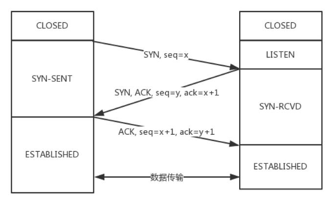

## 四次挥手

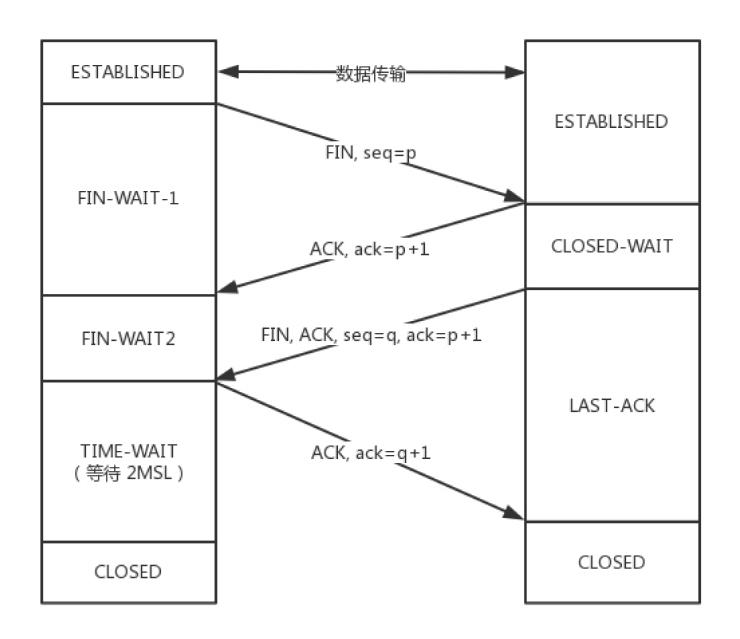

A：B 啊，我不想玩了。
B：哦，你不想玩了啊，我知道了。

这个时候，还只是 A 不想玩了，也即 A 不会再发送数据，但是 B 能不能在 ACK 的时候，直接关闭呢？当然不可以了，很有可能 A 是发完了最后的
数据就准备不玩了，但是 B 还没做完自己的事情，还是可以发送数据的，所以称为**半关闭**的状态。

B：A 啊，好吧，我也不玩了，拜拜。
A：好的，拜拜

这样整个连接就关闭了。

但是这个过程有没有异常情况呢？

1. A 说完“不玩了”之后，直接跑路，是会有问题的，因为 B 还没有发起结束，而如果 A 跑路，B 就算发起结束，也得不到回答，B 就不知
道该怎么办了。
2. A 说完“不玩了”，B 直接跑路，也是有问题的，因为 A 不知道 B 是还有事情要处理，还是过一会儿会发送结束。

TCP 协议专门设计了几个状态来处理这些问题。

A 收到 “B 说知道了”，就进入 FIN_WAIT_2 的状态，如果这个时候 B 直接跑路，则 A 将永远在这个状态。TCP 协议里面并没有对这个状态的
处理，但是 Linux 有，可以调整 `tcp_fin_timeout` 这个参数，设置一个超时时间。

如果 B 没有跑路，发送了 “B 也不玩了” 的请求到达 A 时，A 发送“知道 B 也不玩了”的 ACK 后，从 FIN_WAIT_2 状态结束，按说 A 可以跑路了，
但是最后的这个 ACK 万一 B 收不到呢？则 B 会重新发一个“B 不玩了”，这个时候 A 已经跑路了的话，B 就再也收不到 ACK 了，因而 TCP 协议要
求 A 最后等待一段时间 TIME_WAIT，这个时间要足够长，长到如果 B 没收到 ACK 的话，“B 说不玩了”会重发的，A 会重新发一个 ACK 并且足够时
间到达 B。

A 直接跑路还有一个问题是，A 的端口就直接空出来了，但是 B 不知道，B 原来发过的很多包很可能还在路上，如果 A 的端口被一个新的应用占用了，
这个新的应用会收到上个连接中 B 发过来的包，虽然序列号是重新生成的，但是这里要上一个双保险，防止产生混乱，因而也需要等足够长的时间，等
到原来 B 发送的所有的包都死翘翘，再空出端口来。

等待的时间设为2MSL，**MSL 是 Maximum Segment Lifetime，报文最大生存时间**，它是任何报文在网络上存在的最长时间，超过这个时间报
文将被丢弃。因为 TCP 报文基于是 IP 协议的，而 IP 头中有一个 TTL 域，是 IP 数据报可以经过的最大路由数，每经过一个处理他的路由器此
值就减 1，当此值为 0 则数据报将被丢弃，同时发送 ICMP 报文通知源主机。协议规定 MSL 为 2 分钟，实际应用中常用的是 30 秒，1 分钟
和 2 分钟等。

还有一个异常情况就是，B 超过了 2MSL 的时间，依然没有收到它发的 FIN 的 ACK，怎么办呢？按照 TCP 的原理，B 当然还会重发 FIN，这个时
候 A 再收到这个包之后，A 就表示，我已经在这里等了这么长时间了，已经仁至义尽了，之后的我就都不认了，于是就直接发送 RST，B 就知道 A 早
就跑了。

## TCP 状态机
## 如何实现一个靠谱的协议？
为了保证顺序性，每一个包都有一个 ID。在建立连接的时候，会商定起始的 ID 是什么，然后按照 ID 一个个发送。为了保证不丢包，对于发送的
包都要进行应答，但是这个应答也不是一个一个来的，而是会应答某个之前的 ID，表示都收到了，这种模式称为**累计确认或者累计应
答（cumulative acknowledgment）**。

为了记录所有发送的包和接收的包，TCP 也需要发送端和接收端分别都有缓存来保存这些记录（为了效率，不能每发送一个包，要等到收到了应答，
、再发送下一个，所以先将事情下来，办完一件回复一件）。
发送端的缓存里是按照包的 ID 一个个排列，根据处理的情况分成四个部分。
- 第一部分：发送了并且已经确认的。这部分就是你交代下属的，并且也做完了的，应该划掉的。
- 第二部分：发送了并且尚未确认的。这部分是你交代下属的，但是还没做完的，需要等待做完的回复之后，才能划掉。
- 第三部分：没有发送，但是已经等待发送的。这部分是你还没有交代给下属，但是马上就要交代的。
- 第四部分：没有发送，并且暂时还不会发送的。这部分是你还没有交代给下属，而且暂时还不会交代给下属的。

为什么要区分第三部分和第四部分？
因为流量控制，要考虑接收端的处理能力。

在 TCP 里，接收端会给发送端报一个窗口的大小，叫 **Advertised window**。这个窗口的大小应该等于上面的第二部分加上第三部分，就是
已经交代了没做完的加上马上要交代的。超过这个窗口的，接收端做不过来，就不能发送了。

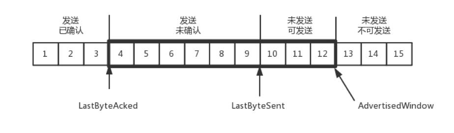

对于接收端来讲，它的缓存里记录的内容要简单一些。
- 第一部分：接受并且确认过的。也就是我领导交代给我，并且我做完的。
- 第二部分：还没接收，但是马上就能接收的。也即是我自己的能够接受的最大工作量。
- 还没接收，也没法接收的。也即超过工作量的部分，实在做不完。

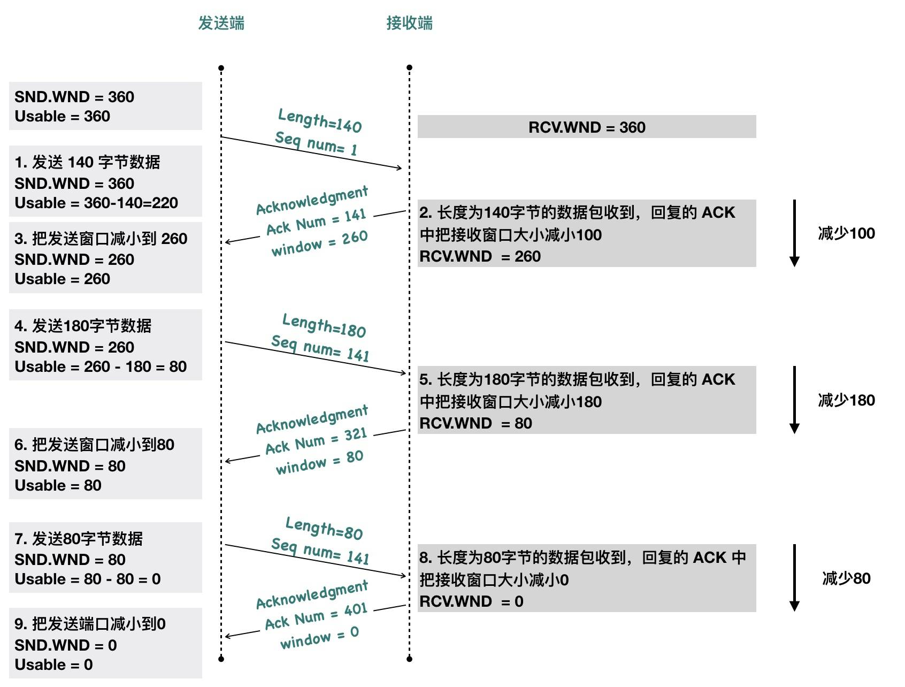

- MaxRcvBuffer：最大缓存的量；
- LastByteRead 之后是已经接收了，但是**还没被应用层读取的**；
- NextByteExpected 是第一部分和第二部分的分界线。

NextByteExpected 和 LastByteRead 的差其实是还没被应用层读取的部分占用掉的 MaxRcvBuffer 的量，我们定义为A。AdvertisedWindow 其实是MaxRcvBuffer 减去A。也就是：
`AdvertisedWindow=MaxRcvBuffer-((NextByteExpected-1)-LastByteRead)`。

其中第二部分里面，由于受到的包可能不是顺序的，会出现空挡，**只有和第一部分连续的，可以马上进行回复，中间空着的部分需要等待，哪怕后面的已经来了**。

### 顺序问题与丢包问题
刚才的图，在发送端来看，1、2、3 已经发送并确认；4、5、6、7、8、9 都是发送了还没确认；10、11、12 是还没发出的；13、14、15 是接收
方没有空间，不准备发的。

在接收端来看，1、2、3、4、5 是已经完成 ACK，但是没读取的；6、7 是等待接收的（虚线）；8、9 是已经接收（实线），但是没有 ACK 的。

当前的状态如下：
- 1、2、3 没有问题，双方达成了一致。
- 4、5 接收方说 ACK 了，但是发送方还没收到，有可能丢了，有可能在路上。
- 6、7、8、9 肯定都发了，但是 8、9 已经到了，但是 6、7 没到，出现了乱序，缓存着但是没办法 ACK。

顺序问题和丢包问题都有可能发生。

#### 确认与重发的机制
假设 4 的确认到了，不幸的是，5 的 ACK 丢了，6、7 的数据包丢了，这该怎么办？

**超时重试**，也即对每一个发送了，但是没有 ACK 的包，都有设一个定时器，超过了一定的时间，就重新尝试。但是这个超时的时间如何评估呢？这
个时间不宜过短，时间必须大于往返时间 RTT，否则会引起不必要的重传。也不宜过长，这样超时时间变长，访问就变慢了。

估计往返时间，需要 TCP 通过采样 RTT 的时间，然后进行加权平均，算出一个值，而且这个值还是要不断变化的，因为网络状况不断的变化。除
了采样 RTT，还要采样 RTT 的波动范围，计算出一个估计的超时时间。由于重传时间是不断变化的，我们称为**自适应重传
算法（Adaptive RetransmissionAlgorithm）**。

如果 7 丢了，重传之后又丢了，**TCP 的策略是超时间隔加倍。每当遇到一次超时重传的时候，都会将下一次超时时间间隔设为先前值的两倍。
两次超时，就说明网络环境差，不宜频繁反复发送**。

#### 快速重传
超时触发重传存在的问题是，超时周期可能相对较长。有一个可以快速重传的机制，当接收方收到一个序号大于下一个所期望的报文段时，就检
测到了数据流中的一个间格，于是发送三个冗余的 ACK，客户端收到后，就在定时器过期之前，重传丢失的报文段。

例如，接收方发现 6、8、9 都已经接收了，就是 7 没来，那肯定是丢了，于是发送三个 6 的 ACK，要求下一个是 7。客户端收到 3 个，就会
发现 7 的确又丢了，不等超时，马上重发。

#### Selective Acknowledgment （SACK）
这种方式需要在 TCP 头里加一个 SACK 的东西，可以将缓存的地图发送给发送方。例如可以发送 ACK6、SACK8、SACK9，有了地图，发送方一
下子就能看出来是 7 丢了。

### 流量控制问题
再看流量控制机制，**在对于包的确认中，同时会携带一个窗口的大小**。

先假设窗口不变的情况，窗口始终为 9。4 的确认来的时候，会右移一个，这个时候第 13 个包也可以发送了。

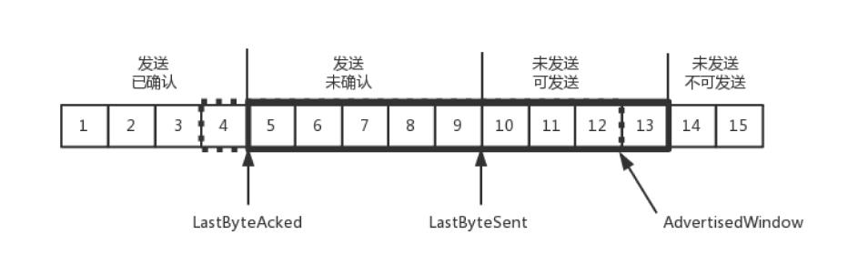

这个时候，假设发送端发送过猛，会将第三部分的10、11、12、13 全部发送完毕，之后就停止发送了，未发送可发送部分为0。


当对于包5 的确认到达的时候，在客户端相当于窗口再滑动了一格，这个时候，才可以有更多的包可以发送了，例如第14 个包才可以发送。


如果接收方实在处理的太慢，导致缓存中没有空间了，可以通过确认信息修改窗口的大小，甚至可以设置为0，则发送方将暂时停止发送。

我们假设一个极端情况，接收端的应用一直不读取缓存中的数据，当数据包6 确认后，窗口大小就不能再是9 了，就要缩小一个变为8。


这个新的窗口8 通过6 的确认消息到达发送端的时候，你会发现窗口没有平行右移，而是仅仅左面的边右移了，窗口的大小从9 改成了8。

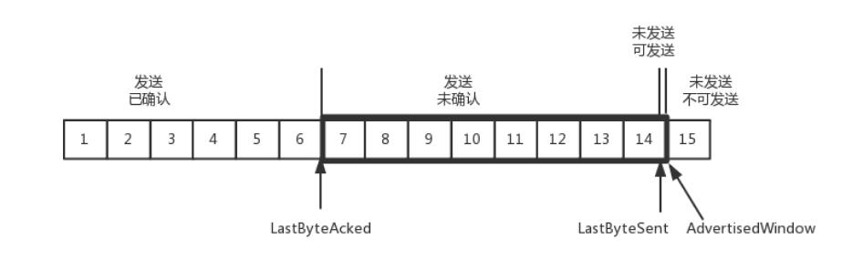

如果接收端还是一直不处理数据，则随着确认的包越来越多，窗口越来越小，直到为0。

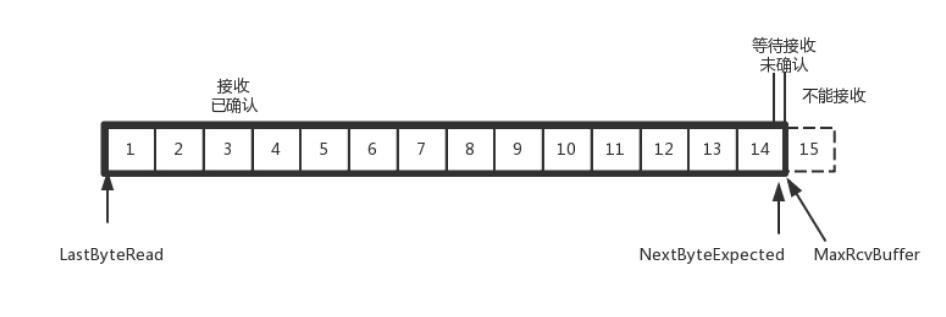

当这个窗口通过包14 的确认到达发送端的时候，发送端的窗口也调整为0，停止发送。

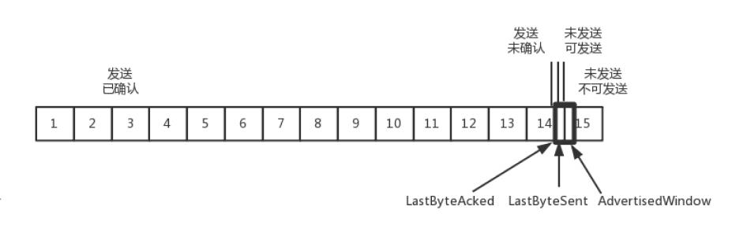

如果这样的话，发送方会定时发送窗口探测数据包，看是否有机会调整窗口的大小。当接收方比较慢的时候，**要防止低能窗口综合征，别空出一个
字节来就赶快告诉发送方，然后马上又填满了，可以当窗口太小的时候，不更新窗口，直到达到一定大小，或者缓冲区一半为空，才更新窗口**。

### 拥塞控制问题
拥塞控制的问题，也是通过窗口的大小来控制的，前面的**滑动窗口 rwnd 是怕发送方把接收方缓存塞满，而拥塞窗口 cwnd，是怕把网络塞满**。

`LastByteSent - LastByteAcked <= min {cwnd, rwnd}`，是拥塞窗口和滑动窗口共同控制发送的速度。

**TCP 的拥塞控制就是在不堵塞，不丢包的情况下，尽量发挥带宽**。

水管有粗细，网络有带宽，也即每秒钟能够发送多少数据；水管有长度，端到端有时延。在理想状态下，水管里面水的量= 水管粗细x 水管长度。对于到
网络上，**通道的容量= 带宽× 往返延迟**。

如果我们设置发送窗口，使得发送但未确认的包为为通道的容量，就能够撑满整个管道。


如图所示，假设往返时间为 8s，去 4s，回 4s，每秒发送一个包，每个包 1024byte。已经过去了 8s，则 8 个包都发出去了，其中前 4 个包已经到
达接收端，但是 ACK 还没有返回，不能算发送成功。5-8 后四个包还在路上，还没被接收。这个时候，整个管道正好撑满，在发送端，已发送未确认的
为 8 个包，正好等于带宽，也即每秒发送 1 个包，乘以来回时间 8s。

TCP 的拥塞控制主要来避免两种现象，包丢失和超时重传。一旦出现了这些现象就说明，发送速度太快了，要慢一点。但是一开始我怎么知道速度多快
呢，我怎么知道应该把窗口调整到多大呢？如果我们通过漏斗往瓶子里灌水，我们就知道，不能一桶水一下子倒进去，肯定会溅出来，要一开始慢慢
的倒，然后发现总能够倒进去，就可以越倒越快。这叫作**慢启动**。

一条 TCP 连接开始，cwnd 设置为一个报文段，一次只能发送一个；当收到这一个确认的时候，cwnd加一，于是一次能够发送两个；当这两个
的确认到来的时候，每个确认 cwnd 加一，两个确认 cwnd 加二，于是一次能够发送四个；当这四个的确认到来的时候，每个确认 cwnd 加一，
四个确认 cwnd 加四，于是一次能够发送八个。可以看出这是**指数性的增长**。

**有一个值 ssthresh 为 65535 个字节，当超过这个值的时候，就要小心一点了，不能倒这么快了，可能快满了，再慢下来。**

每收到一个确认后，cwnd 增加 1/cwnd，我们接着上面的过程来，一次发送八个，当八个确认到来的时候，每个确认增加 1/8，八个确认一共 cwnd 增
加 1，于是一次能够发送九个，变成了线性增长。但是线性增长还是增长，还是越来越多，直到有一天，水满则溢，出现了拥塞，这时候一般就会一下子
降低倒水的速度，等待溢出的水慢慢渗下去。拥塞的一种表现形式是丢包，需要超时重传，这个时候，将 sshresh 设为 cwnd/2，将 cwnd 设为 1，重
新开始慢启动。这真是一旦超时重传，马上回到解放前。但是这种方式太激进了，将一个高速的传输速度一下子停了下来，会造成网络卡顿。

当接收端发现丢了一个中间包的时候，发送三次前一个包的ACK，于是发送端就会快速的重传，不必等待超时再重传。TCP 认为这种情况不严重，因为大部
分没丢，只丢了一小部分，cwnd 减半为 cwnd/2，然后 sshthresh = cwnd，当三个包返回的时候，cwnd = sshthresh +3，也就是没有一夜回到
解放前，而是还在比较高的值，呈线性增长。就像前面说的一样，正是这种知进退，使得时延很重要的情况下，反而降低了速度。但是如果你仔细想一下，
TCP 的拥塞控制主要来避免的两个现象都是有问题的。

- 第一个问题是丢包并不代表着通道满了，也可能是管子本来就漏水。例如公网上带宽不满也会丢包，这个时候就认为拥塞了，退缩了，其实是不对的。
- 第二个问题是 TCP 的拥塞控制要等到将中间设备都填充满了，才发生丢包，从而降低速度，这时候已经晚了。其实 TCP 只要填满管道就可以了，不应
该接着填，直到连缓存也填满。

为了优化这两个问题，后来有了 TCP BBR 拥塞算法。它企图找到一个平衡点，就是通过不断的加快发送速度，将管道填满，但是不要填满中间设备的缓
存，因为这样时延会增加，在这个平衡点可以很好的达到高带宽和低时延的平衡。

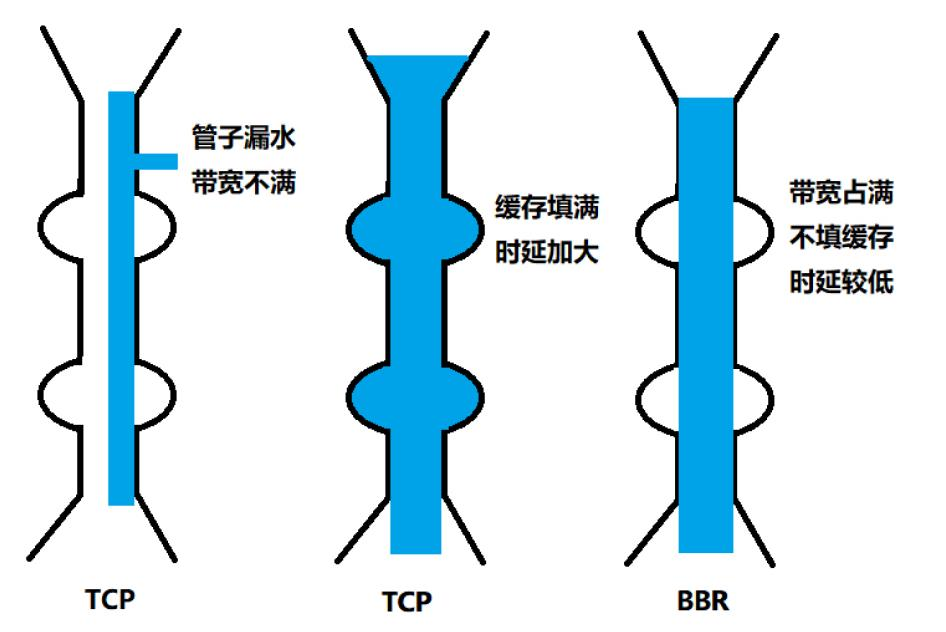